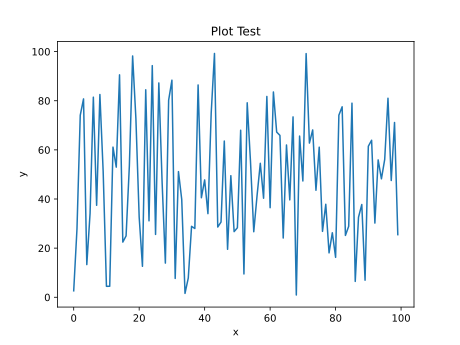
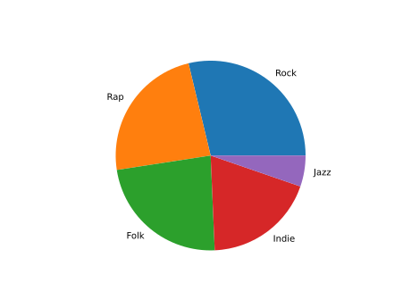
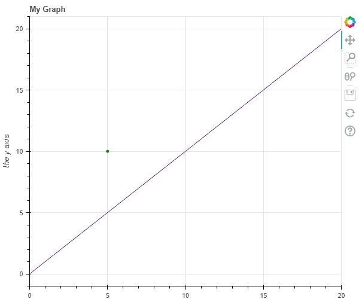
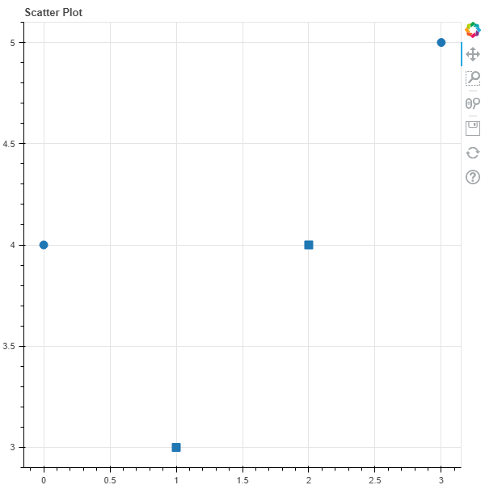
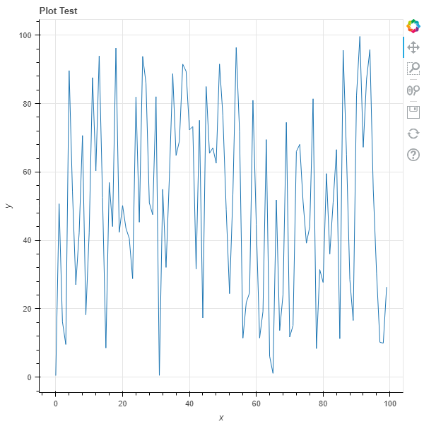
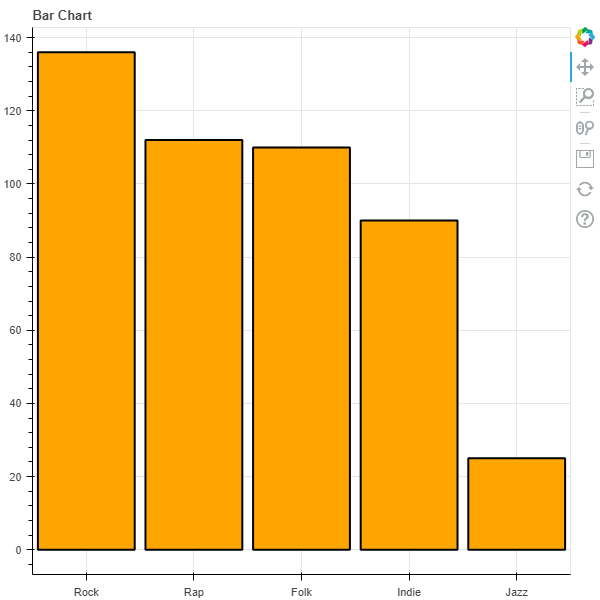
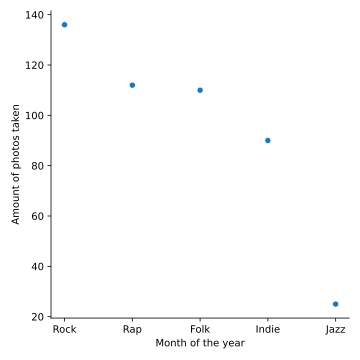
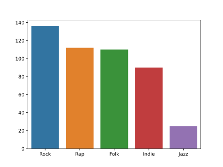
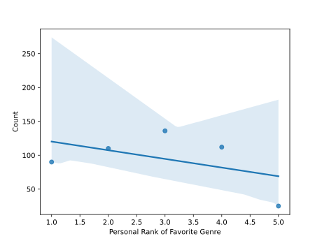

# Python Graphics


In Python, data and equations can be visually represented using graphs
and plots.  Whereby showcasing how to use different plotting libraries,
this includes Matplotlib, Bokeh, and Seaborn.

## Matplotlib

Matplotlib is a library that allows the user to visualize data. 
The library can create pie charts, bar charts, line
plots, and other graphs specifically for data visualization. 
Matplotlib creates figures that can be manipulated and transformed.
This includes manipulations of axes, labels, fonts, and the size 
of the images. 

### Installation

To install matplotlib, please use the command:

```bash
$ pip install matplotlib
```

### Import Statements

The user will need to supply these import statements at the top of their code in 
order for Matplotlib to be imported.

```python
import matplotlib.pyplot as plt
import numpy as np
```

### Bar Chart

In matplotlib, it is easy to create bar charts. For example, this is a
demonstration of a simple bar chart using data from a user using
Spotify.

```python
import matplotlib.pyplot as plt

# you can also do this: from matplotlib import pyplot as plt

data = {'Rock': 136, 'Rap': 112, 'Folk': 110, 'Indie': 90, 'Jazz': 25}
categories = data.keys()
count = data.values()

# Creating the bar chart
plt.bar(categories, 
        count, 
        align='edge', 
        color='darkorange', 
        width=0.4, 
        edgecolor="royalblue", 
        linewidth=4)

# Editing the bar chart's title, x, and y axes
plt.xlabel("Genre of Music")
plt.ylabel("Number of songs in the genre")
plt.title("Distribution of Genres in My Liked Songs")
plt.show()
```

This program can be downloaded from [GitHub](https://github.com/cybertraining-dsc/reu2022/tree/main/project/graphics/examples/matplotlib-barchart.py)

The output of this program is showcased in Figure *barchart*.


Figure *barchart*: Barchart created from data from Spotify

### Line Chart 

The matplotlib library in python allows for comprehensive line plots
to be created.  Here a line chart was created using a for loop to
generate random numbers in a range and plot it against the `x` and `y`
axis to display the changes between two variables/data sets.

```python
import matplotlib.pyplot as plt
import random

x = []
y = []
for i in range(0, 100):
    x.append(i)
    value = random.random() * 100
    y.append(value)

# creating the plot and labeling axes and title
plt.plot(x, y)
plt.xlabel("x")
plt.ylabel("y")
plt.title("Plot Test")
plt.show()
```

This program can be downloaded from [GitHub](https://github.com/cybertraining-dsc/reu2022/tree/main/project/graphics/examples/matplotlib-linechart.py)

The output of this program is showcased in Figure *linechart*.




Figure *linechart*: Linechart created from random variables


### Pie Chart

A pie chart is most commonly used when representing the division of
components that form a whole thing e.g. showing how a budget is broken
down into separate spending categories. In matplotlib, the function
`pie()`creates a pie chart.  In the following code example, a user's
Spotify data will be displayed as a pie chart.

```python
import matplotlib.pyplot as plt

data = {'Rock': 136, 'Rap': 112, 'Folk': 110, 'Indie': 90, 'Jazz': 25}
categories = data.keys()
count = data.values()

# Creating the pie chart
plt.pie(count, labels=categories)

plt.show()
```

This program can be downloaded from [GitHub](https://github.com/cybertraining-dsc/reu2022/tree/main/project/graphics/examples/matplotlib-piechart.py)

The output of this program is showcased in Figure *piechart*.




Figure *piechart*: Barchart created from data from Spotify

### Contour Plot

Unlike the previous types of plots shown, contour plots allow
data involving three variables to be plotted on a 2D surface.
In this example, an equation of a hyperbolic paraboloid is
graphed on a contour plot.

```python
import matplotlib.pyplot as plt
import numpy as np

#creating an equation for z based off of variables x,y
x, y = np.meshgrid(np.linspace(-10, 10), np.linspace(-10, 10))
z = 9*(x**2+1)+8*x-(y**2)
levels = np.linspace(np.min(z), np.max(z), 15)

#creating a contour graph based off the equation of z
plt.contour(x,y,z, levels=levels)


plt.xlabel("x")
plt.ylabel("y")
plt.title("Function of z(x,y)")
plt.show()
```

This program can be downloaded from [GitHub](https://github.com/cybertraining-dsc/reu2022/tree/main/project/graphics/examples/matplotlib-contour.py)

The output of this program is showcased in Figure *contourplot*.


Figure *contourplot*: Multivariable (x, y, z) Equation Plotted

A contour plot allows data and equations consisting of three
variables to be plotted through plotting 3D surfaces as 2D 
slices on a `xy` plane. Matplotlib can display 
data and equations through contour graphs after they are 
inputted. Shown below are the parameters for `plt.contour`.


```python
plt.contour([x, y], z, levels)
```

The independent variables `x` and `y` must be defined so the 
dependent variable `z` can be defined. The variables can 
come in the form of a list or dictionary or as an equation.
The `levels` parameter determines the number of contour lines
that can be drawn. 

### Titles, Labels, and Legends 

#### Titles

Titles are necessary to let the reader know about your graph or 
plot is exactly about. To give a title to your whole graph in 
matplotlib, simply type:

```python
plt.title("Title you want to set").
```

#### x-axis labels and y-axis labels

Within the matplotlib library are the functions `plt.xlabel()` and 
`plt.ylabel()`. All these functions do is set a string to the two 
axes. To use these functions, simply type:

```python
plt.xlabel("Label you want to set")
plt.ylabel("Label you want to set")
```

#### Legend

Sometimes, a legend may be necessary to let the reader know which
part of the graph/plot corresponds to each part of the data shown.
To show a legend, use the command:

```python
plt.legend()
```

### Rotating Ticks

When a chart is created, ticks are automatically created on the axes. By default,
they are set horizontally; however, they can be rotated using `plt.xticks(degrees)`
for the `x-axis` or `plt.yticks(degrees)` for the `y-axis`. This can be shown by
this simple [example](https://github.com/cybertraining-dsc/reu2022/blob/main/project/graphics/examples/rotatingticks.py).

```python
import matplotlib.pyplot as plt

x = range(0,4)
y = x
plt.plot(x,y)

# Rotating Ticks
plt.xticks(rotation=90)
plt.yticks(rotation=45)

plt.xlabel('x values')
plt.ylabel('y values')
plt.title(r'$y=x$')
plt.show()
```


Figure *ticks* `x-axis` ticks rotated by 90° and `y-axis` ticks rotated by 45°


### Exporting

#### Saving Chart as Files
After a chart is created and displayed, it can be exported as a file outside the
code using this command:

```python
plt.savefig("fname", dpi='figure')
```

The name and format of the file are set as a string using `fname`. Make sure to 
specify the format of the file by using a `.` after the file name and specify the 
type after such as `.pdf`, `.png`, `svg`, etc.

The parameter `dpi` sets the DPI (Dots per Inch) of the image being saved. Specify 
this number in the form of a float. For example, set `dpi=300`.

Additionally, there is another way to save files that may be faster than calling a
specific method for each file. The following code showcases this:

```python
import matplotlib.pyplot as plt
import os
from matplotlib import pyplot


def save():
    name = os.path.basename(__file__).replace(".py", "")
    plt.savefig(f'/filepath/{name}.png')
    plt.savefig(f'filepath/{name}.pdf')
    plt.savefig(f'filepath/{name}.svg')
    plt.show()
```

This code can be accessed on [GitHub](https://github.com/cybertraining-dsc/reu2022/tree/main/project/graphics/examples/matplotlib-linechart.py)

#### Display

The very last command that should be written is `plt.show()`,
as this command displays the graph that you made. To show, simply
type:

```python
plt.show()
```

## Bokeh

Bokeh is a Python library useful for generating visualizations 
for web browsers. It generates graphics for all types of plots 
and dashboards powered by JavaScript without the user’s need to
write any JavaScript code. The guide below will walk you 
through useful Bokeh commands and features.

### Installation

To install Bokeh, please use the command:
```bash
$ pip install bokeh
```

### Import Statements

To plot figures, we import the `show` and `figure` functions
from the Bokeh libraries.

```python
from bokeh.io import show
from bokeh.plotting import figure
```

### Bokeh Plotting Interface

`bokeh.plotting` is the library’s main interface. It gives the ability to
generate plots easily by providing parameters such as axes, 
grids, and labels. The following code shows some of the simplest 
examples of plotting a line and a point on a chart.

```python
from bokeh.io import show
from bokeh.plotting import figure

# labeling the title, specifying the range of the x-axis, labeling the y-axis, specifying the height to be 500 pxls
p = figure(title = "My Graph", x_range = [0,20], y_axis_label = "the y axis", height = 500)

# plotting a line from (0,0) to (20,20); any of the CSS colors can be used
p.line([0,20],[0, 20], color='indigo')

# plotting a point (circle) at (5,10)
p.circle(5,10, color = 'green')

show(p)
```

This program can be downloaded from [GitHub](https://github.com/cybertraining-dsc/reu2022/tree/main/project/graphics/examples/bokeh-figure.py)



Figure *lineplot*: Figure created with Bokeh. 


### Figure Parameters Example

* <b>x_axis_label</b> and <b>y_axis_label</b>: labels for the x and y axis
* <b>x_range</b> and <b>y_range</b>: specifications for the range of the x and y axis
* <b>title</b>: text title for your graph
* <b>width</b> and <b>height</b>: width and height of your graph in pixels
* <b>background_fill_color</b>: the background of the figure (takes any CSS colors)

### Saving Figures

Bokeh also supports outputs to a static HTML file with a
specific name.

```python
from bokeh.plotting import output_file
output_file("name.html")
```

After importing the Bokeh plotting interface, it is possible to be
able to create different types of plots utilizing the figure
created with the figure function.

#### Saving Figures as PNG

In order to save figures as a PNG, both Selenium and a web
driver will need to be installed. We will use Chromium here for our
web driver. To install both at once, use the commands:

(Windows)
```bash
$ pip install selenium chromedriver-binary
$ pip install chromedriver-binary-auto
```

There seems to be issues installing `chromedriver-binary` on Mac computers due to the built-in security, so it is
recommended to simply save Bokeh figures as a `.html` file.

When writing a program, Chromium must be added to the PATH through these import
statements:

```python
from selenium import webdriver
import chromedriver_binary
```

Bokeh appears to support saving files as a `.svg` but it seems to have bugs and is not recommended. To use the functions,
`export_png()` and `export_svg()` must be imported, and can be used as follows:

```python
from bokeh.io import export_png, export_svg

export_png(fig, filename="file-name.png")
export_svg(fig, filename="file-name.svg")
```

Note that Chromium is slow and this process may take delay the execution and performance of the program.

Similarly to matplotlib, Bokeh can utilize a function to save all created images. 

```python
from matplotlib import pyplot as plt
from bokeh.io import export_png, export_svg
import os

def save(p):
    name = os.path.basename(__file__).replace(".py", "")
    export_png(p, filename=f"images/{name}.png")
    export_svg(p, filename=f"images/{name}.svg")
    plt.show(p)
```

This code can be accessed on [GitHub](https://github.com/cybertraining-dsc/reu2022/tree/main/project/graphics/examples/bokeh-linechart.py).

### Scatter Plot

The Bokeh library provides various marker shapes for marking
points on the scatter plot. The example below demonstrates
how to create a scatter plot with two points at locations 
(1,3) and (2,4) respectively with circular and square marker
shapes. The size parameter controls the size of the marker.

```python
from bokeh.io import show
from bokeh.plotting import figure

p = figure(title="Scatter Plot")

# Circle
p.circle([0,3], [4,5], size = 10)

# Square
p.square([1,2], [3,4], size = 10)

show(p)
```

This program can be downloaded from [GitHub](https://github.com/cybertraining-dsc/reu2022/tree/main/project/graphics/examples/bokeh-scatter.py)



Figure *Scatter Plot*: Scatter Plot created with user Spotify data.

The list of all possible marker types and the functions used 
to create them can be found [here](http://docs.bokeh.org/en/latest/docs/user_guide/plotting.html)


### Line Plots

The library provides a series of functions for creating various 
types of line graphs ranging from a single line graph, step line 
graph, stacked line graph, multiple line graph, and so on.


```python
from bokeh.io import show, export_png, export_svg
from bokeh.plotting import figure
import random

x = []
y = []
for i in range(0, 100):
    x.append(i)
    value = random.random() * 100
    y.append(value)
    
p = figure(title="Plot Test", x_axis_label = "x", y_axis_label = "y")
p.line(x,y)

show(p)
```

This program can be downloaded from [GitHub](https://github.com/cybertraining-dsc/reu2022/tree/main/project/graphics/examples/bokeh-line.py)



Figure *Line Plot*: Line Plot created with user Spotify data. 

You can find the source code for other types of line plots here:
<http://docs.bokeh.org/en/latest/docs/user_guide/plotting.html>


### Bar Chart

Similarly, the `hbar()` and `vbar()` functions can be used to display
horizontal and vertical bar graphs, respectively.

```python
from bokeh.io import show, export_png, export_svg
from bokeh.plotting import figure

data = {'Rock': 136, 'Rap': 112, 'Folk': 110, 'Indie': 90, 'Jazz': 25}
x = list(data.keys())
y = list(data.values())

p = figure(x_range = x, title="Bar Chart")

p.vbar(x=x, top = y, line_color = 'black',color='orange', width = 0.9, line_width = 2)

show(p)
```

This program can be downloaded from [GitHub](https://github.com/cybertraining-dsc/reu2022/tree/main/project/graphics/examples/bokeh-bar.py)



Figure *Bar Chart*: Bar Chart created with user Spotify data. 

## Seaborn

Seaborn, like Matplotlib, is a data visualization tool. However,
the graphs and charts that Seaborn can create are more complex
than Matplotlib. The graphs that are created in Seaborn are
more statistically detailed. Unlike matplotlib, Seaborn draws
upon other imported libraries such as Matplotlib, Numpy, and Pandas.
This is because Seaborn relies on more complex math (Numpy) and 
data frames (generated from Pandas) that are passed into its functions
as the data. 

Several types of plots can be made from Seaborn; they are
relational, distributional, categorical, regression, and matrix
plots.

We have created examples to demonstrate the abilities of Seaborn.

### Installation

Seaborn can be installed in the same way as the other 
libraries installed earlier. The user who is installing the
library should make sure that it is being installed in the 
correct environment. 

```bash
$ pip install seaborn
```

### Import Statements

The user will need to supply these import statements at the top
of their code in order for Seaborn to be imported. 
Additionally, the data created for the examples represents
a user's Liked songs from Spotify. 

```python
import seaborn as sns
import matplotlib.pyplot as plt

data = {'Rock': 136, 'Rap': 112, 'Folk': 110, 'Indie': 90, 'Jazz': 25}
categories = list(data.keys())
count = list(data.values())
personal_rank = [3, 4, 2, 1, 5]
```

### Relational Plots

Relational plots showcase the relationship between
variables in a visual format. It is a broad term for data 
representation. Examples of relational plots in Seaborn are 
`relplot` `lineplot` and `scatterplot`. 

It is simple to create a relational plot with Seaborn: 

```python
sns.relplot( x=months , y=photos)
plt.xlabel("Month of the year")
plt.ylabel("Amount of photos taken")
plt.show()
```
This program can be downloaded from [GitHub](https://github.com/cybertraining-dsc/reu2022/blob/main/project/graphics/examples/seaborn-images.py)

The output of this program is showcased in Figure *lineplot*



Figure *lineplot*: Lineplot created from user Spotify data.

### Distribution Plots

A distribution plot shows how the data is concentrated in
a range of values. The graph that appears looks similar to a bar
graph in that there are bars. However, these bars show the concentration of a 
variable across a range of values rather than the quantity possessed by 
a singular variable. The distributional plots in Seaborn are `displot` `histplot`
`kdeplot` `ecdfplot` and `rugplot`.


```python
sns.displot(x=source, y=value)
plt.show()
```
This program can be downloaded from [GitHub](https://github.com/cybertraining-dsc/reu2022/blob/main/project/graphics/examples/seaborn-images.py)

The output of this program is showcased in Figure *displot*


Figure *displot*: Displot created from user Spotify data. 


### Categorical Plots

Categorical plots are statistical graphs that help 
visualize the magnitudes of different variables in a dataset. 
A type of categorical plot is a bar chart, exactly like 
the example produced in the Matplotlib section. The categorical plots are
`catplot` `stripplot` `swarmplot` `boxplot` `violinplot` `boxenplot` 
`pointplot` `barplot` and `countplot`.

Categorical plots are relatively simple to implement. 
If using the `catplot` method, it is necessary to include the
`kind` parameter. 

```python
sns.barplot(x=source, y=value)
plt.show()
```
This program can be downloaded from [GitHub](https://github.com/cybertraining-dsc/reu2022/blob/main/project/graphics/examples/seaborn-images.py)

The output from the program is showcased in Figure *catplot*



Figure *catplot*: Created from user Spotify data. 

### Regression Plots

Regression plots are like relational plots in the way 
that they help visualize the relationship between two 
variables. Regression plots, however, show the linear 
correlation that may or may not exist in a scatter plot
of data. Their regression plots are `lmplot` `regplot` and `residplot`.

Regression plots are simple to implement:

```python
sns.regplot(x=months, y=photos)
plt.show()
```
This program can be downloaded from [GitHub](https://github.com/cybertraining-dsc/reu2022/blob/main/project/graphics/examples/seaborn-images.py)

The output of this program is showcased in Figure *regplot*



Figure *regplot*: Created from user Spotify data. 

Each of these plots can be manipulated to the users 
needs via the API that is listed in the sources section. 

### Saving Figures

Saving figures created by Seaborn is quite simple. This is 
because it is the exact same as in Matplotlib. 

To save a figure:

```python
plt.savefig('figure_path/figure_name')
```

This program can be downloaded from [GitHub](https://github.com/cybertraining-dsc/reu2022/blob/main/project/graphics/examples/seaborn-images.py)


## Sources

### Matplotlib

* <https://matplotlib.org/>
* <https://matplotlib.org/stable/api/pyplot_summary.html>
* <https://www.activestate.com/resources/quick-reads/what-is-matplotlib-in-python-how-to-use-it-for-plotting/>
* <https://www.geeksforgeeks.org/bar-plot-in-matplotlib/>

### Seaborn

* <https://seaborn.pydata.org/api.html>
* <https://www.geeksforgeeks.org/python-seaborn-tutorial/>
* <https://www.geeksforgeeks.org/introduction-to-seaborn-python/>
* <https://www.geeksforgeeks.org/plotting-graph-using-seaborn-python/>
* <https://stackoverflow.com/questions/30336324/seaborn-load-dataset>
* <https://github.com/mwaskom/seaborn-data/blob/master/planets.csv>

### Bokeh

* <http://docs.bokeh.org/en/latest/docs/user_guide/plotting.html>
* <http://docs.bokeh.org/en/latest/docs/user_guide/plotting.html>
* <http://docs.bokeh.org/en/latest/>
* <https://docs.bokeh.org/en/latest/docs/reference/plotting/figure.html>


